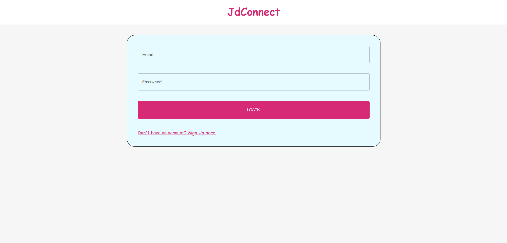
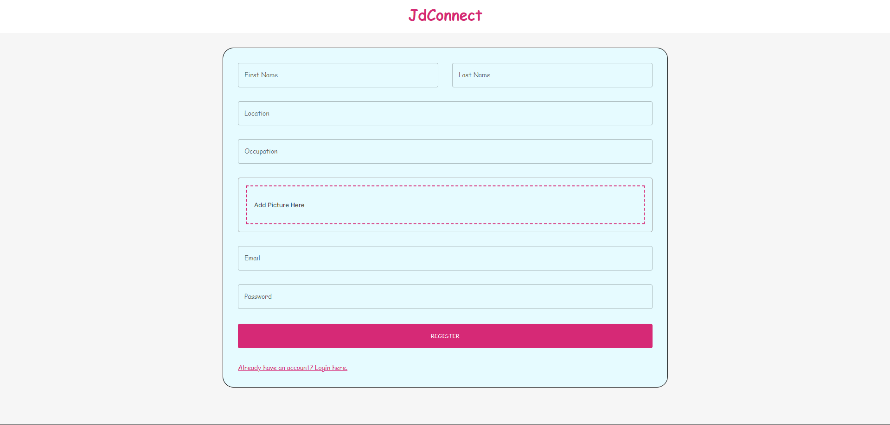
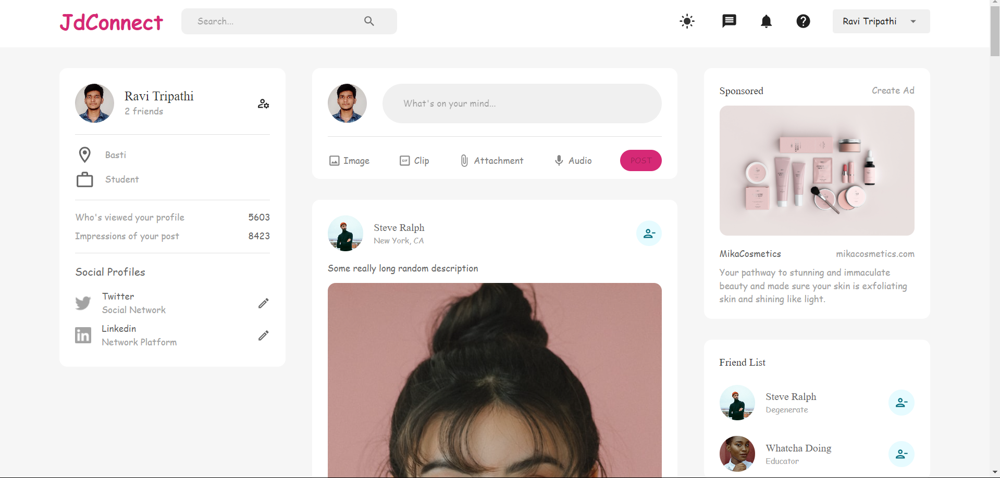
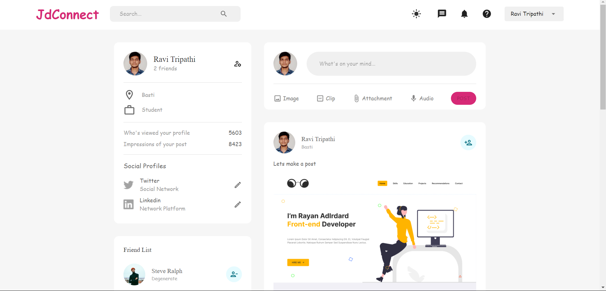

# JdConnect
This project is a full-fledged social media platform built using the MERN (MongoDB, Express, React, Node.js) stack. 
It provides users with the ability to create profiles, post updates, interact with other users, and explore content in a dynamic and responsive web application. 

